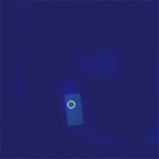

# Robot Gripper: DQN vs Double DQN vs Dueling DQN

IRB360 델타 로봇과 진공 그리퍼를 사용한 Pick-and-Place 작업 학습  
**DQN, Double DQN, Dueling DQN** 세 가지 강화학습 알고리즘 비교 분석



---

## 📋 프로젝트 개요

CoppeliaSim 시뮬레이션 환경에서 IRB360 델타 로봇이 진공 그리퍼로 물체를 집는 **Grasp 작업**을 강화학습으로 학습합니다.

### 주요 특징

- **3가지 DQN 알고리즘**: Standard DQN, Double DQN, Dueling DQN
- **IRB360 델타 로봇**: 진공 그리퍼 (회전 불필요 → 학습 속도 2배 향상)
- **Curriculum Learning**: 단계적 탐색 영역 확장 (물체 → 전체 영역)
- **바닥 감지**: 그리퍼 영역 내 Z값 검증으로 즉시 실패 처리

---

## 🛠️ 설치

### 1. 필수 요구사항

- **Python 3.8+**
- **CoppeliaSim 4.4+** ([다운로드](https://www.coppeliarobotics.com/downloads))
- **CUDA** (선택, GPU 가속용)

### 2. 패키지 설치

```bash
# 저장소 클론
git clone https://github.com/Kiyong314/robot-gripper-dqn-vs-double-vs-dueling.git
cd robot-gripper-dqn-vs-double-vs-dueling

# 의존성 설치
pip install torch torchvision numpy opencv-python matplotlib scipy
```

### 3. CoppeliaSim 씬 로드

1. CoppeliaSim 실행
2. `simulation1.ttt` 파일 열기
3. 시뮬레이션 시작 (▶️ 버튼)

---

## 🚀 사용 방법

### 📚 1. 학습 (Training)

#### Standard DQN
```bash
python main_irb360.py --is_sim --obj_mesh_dir objects/blocks --num_obj 10 --grasp_rewards --experience_replay --save_visualizations
```

#### Double DQN
```bash
python main_irb360.py --is_sim --obj_mesh_dir objects/blocks --num_obj 10 --double_dqn --target_update_freq 30 --grasp_rewards --experience_replay --save_visualizations
```

#### Dueling DQN
```bash
python main_irb360.py --is_sim --obj_mesh_dir objects/blocks --num_obj 10 --dueling_dqn --grasp_rewards --experience_replay --save_visualizations
```

#### Double + Dueling DQN (권장)
```bash
python main_irb360.py --is_sim --obj_mesh_dir objects/blocks --num_obj 10 --double_dqn --dueling_dqn --target_update_freq 30 --grasp_rewards --experience_replay --save_visualizations
```

**학습 결과**: `logs/YYYY-MM-DD.HH.MM.SS/` 폴더에 자동 저장

---

### 🧪 2. 테스트 (Testing)

학습된 모델로 성능 평가:

```bash
python main_irb360.py \
    --is_sim \
    --obj_mesh_dir objects/blocks \
    --num_obj 10 \
    --is_testing \
    --load_snapshot \
    --snapshot_file "saved_model\DQN\snapshot-002100.reinforcement.pth" \
    --max_test_trials 30 \
    --save_visualizations
```

**옵션 설명**:
- `--max_test_trials 30`: 30회 시도 후 자동 종료
- `--save_visualizations`: Q-value 히트맵 저장

---

### 📊 3. 모델 평가 (Evaluation)

모든 체크포인트를 자동으로 평가하고 결과 비교:

```bash
# 단일 모델 평가
python evaluate_checkpoints.py logs/2025-12-07.12.29.59_dqn/models --trials 30 --objects 10

# 결과 시각화
python plot_evaluation_results.py evaluation/2025-12-07.12.29.59_dqn/evaluation_results.csv
```

**출력**:
- `evaluation/{model_name}/evaluation_results.csv`: 성공률, Q-value 통계
- `evaluation/{model_name}/iter_XXXXXX/`: 각 체크포인트별 상세 로그

---

### 🔍 4. 학습 계속하기 (Resume Training)

중단된 학습 재개:

```bash
python main_irb360.py \
    --is_sim \
    --obj_mesh_dir objects/blocks \
    --num_obj 10 \
    --double_dqn --dueling_dqn \
    --load_snapshot \
    --snapshot_file "logs/2025-12-07.12.29.59/models/snapshot-001250.reinforcement.pth" \
    --logging_directory "logs/2025-12-07.12.29.59" \
    --continue_logging \
    --grasp_rewards --experience_replay --save_visualizations
```

---

## ⚙️ 주요 옵션

| 옵션 | 기본값 | 설명 |
|------|--------|------|
| `--is_sim` | False | 시뮬레이션 모드 활성화 (**필수**) |
| `--double_dqn` | False | Double DQN 사용 (Q값 과대추정 방지) |
| `--dueling_dqn` | False | Dueling DQN 사용 (Value/Advantage 분리) |
| `--num_obj` | 10 | 시뮬레이션 물체 개수 |
| `--target_update_freq` | 100 | Target network 업데이트 주기 (iterations) |
| `--experience_replay` | True | Experience Replay 사용 |
| `--grasp_rewards` | True | 보상 기반 학습 활성화 |
| `--save_visualizations` | False | Q-value 히트맵 저장 (0.6초/iteration 추가) |
| `--max_test_trials` | 30 | 테스트 모드 최대 시도 횟수 |
| `--gripper_diameter` | 0.005 | 그리퍼 지름 (m), 바닥 감지 영역 |

---

## 📂 학습 결과 확인

```
logs/YYYY-MM-DD.HH.MM.SS/
├── data/                  # RGB-D 이미지 데이터
├── models/                # 모델 체크포인트 (.pth)
│   ├── snapshot-000000.reinforcement.pth
│   ├── snapshot-000050.reinforcement.pth
│   └── ...
├── transitions/           # 학습 로그
│   ├── grasp-success.log.txt      # 성공(1.0), 실패(0.0), 바닥(-1.0)
│   ├── predicted-value.log.txt    # 예측 Q값
│   ├── reward-value.log.txt       # 보상 값
│   ├── epsilon.log.txt            # Epsilon-greedy 탐색 기록
│   └── object-count.log.txt       # 씬 내 물체 개수 (테스트 모드)
└── visualizations/        # Q-value 히트맵 이미지
    ├── 000000.grasp.png
    └── ...
```

---

## 🔬 알고리즘 비교

### 1. Standard DQN
- 기본 Deep Q-Network
- Q-learning에 신경망 적용

### 2. Double DQN
- **문제**: Q값 과대추정 (Overestimation Bias)
- **해결**: 행동 선택(Main)과 Q값 평가(Target)에 다른 네트워크 사용
- **수식**: `Q_target = r + γ * Q_target(s', argmax_a Q_main(s', a))`

### 3. Dueling DQN
- **아이디어**: Q값을 Value(상태 가치)와 Advantage(행동 이점)로 분리
- **수식**: `Q(s,a) = V(s) + (A(s,a) - mean(A(s,a)))`
- **장점**: 모든 행동의 Q값을 명시적으로 평가하지 않아도 상태 가치 학습

---

## 🔧 카메라 캘리브레이션 (선택)

로봇 좌표계와 이미지 좌표계 매핑을 위한 Homography 행렬 계산:

```bash
cd test
python compute_calibration.py
```

**생성 파일**:
- `camera_calibration.npy`: Pixel → World 변환 행렬
- `camera_calibration_inv.npy`: World → Pixel 변환 행렬

---

## 📁 프로젝트 구조

```
robot-gripper-dqn-vs-double-vs-dueling/
├── main_irb360.py              # 메인 학습 스크립트
├── DQNModels.py                # DQN/Dueling DQN 모델
├── DQNTrainer.py               # 학습 로직 (Double DQN 포함)
├── network.py                  # FeatureTrunk (DenseNet-121)
├── utils.py                    # Heightmap 생성, 좌표 변환
├── logger.py                   # 로그 관리
├── evaluate_checkpoints.py     # 모델 평가 스크립트
├── plot_evaluation_results.py  # 결과 시각화
├── simulation.ttt              # CoppeliaSim 씬 파일
├── objects/blocks/             # 3D 물체 모델 (.obj)
└── test/
    ├── robot_zmq_irb360.py     # IRB360 ZMQ 통신 클래스
    ├── test_camera.py          # 카메라 테스트
    └── compute_calibration.py  # 캘리브레이션 계산
```

---

## 📚 참고 문헌

### 논문
- **DQN**: Mnih et al., "Human-level control through deep reinforcement learning", *Nature*, 2015
- **Double DQN**: Van Hasselt et al., "Deep Reinforcement Learning with Double Q-learning", *AAAI*, 2016
- **Dueling DQN**: Wang et al., "Dueling Network Architectures for Deep Reinforcement Learning", *ICML*, 2016

### 참고 코드
이 프로젝트는 다음 오픈소스를 기반으로 개발되었습니다:

1. **Marwan Qaid Mohammed** - [Learning-Pick-to-Place-Objects](https://github.com/Marwanon/Learning-Pick-to-Place-Objects-in-a-cluttered-scene-using-deep-reinforcement-learning)
   - 논문: "Learning Pick to Place Objects using Self-supervised Learning with Minimal Training Resources", *IJACSA*, 2021
   - 사용: `network.py`, `logger.py`, `DQNModels.py` (일부), `DQNTrainer.py` (일부)

2. **Andy Zeng et al.** - [Visual-Pushing-Grasping](https://github.com/andyzeng/visual-pushing-grasping)

---

## ✨ 본 프로젝트의 독자적 기여

| 기능 | 파일 | 설명 |
|------|------|------|
| **Double DQN** | `DQNTrainer.py` | Target Network 분리, Q값 과대추정 방지 |
| **Dueling DQN** | `DQNModels.py` | Value + Advantage 스트림 분리 |
| **IRB360 통합** | `robot_zmq_irb360.py` | CoppeliaSim ZMQ API 기반 로봇 제어 |
| **진공 그리퍼** | `robot_zmq_irb360.py` | 흡착/해제 시그널, 센서 기반 하강 |
| **Curriculum Learning** | `main_irb360.py` | 단계적 탐색 영역 확장 전략 |
| **바닥 감지** | `main_irb360.py` | 그리퍼 영역 Z값 검증 및 즉시 실패 처리 |
| **모델 평가** | `evaluate_checkpoints.py` | 자동화된 성능 평가 및 비교 분석 |

---

## 📝 License

MIT License

## 👤 Author

GitHub: [@Kiyong314](https://github.com/Kiyong314)

---

## 💡 Tips

### 학습 속도 향상
- `--save_visualizations` 제거 시 **40% 속도 향상**
- GPU 사용 시 **10배 속도 향상** (CUDA 필요)

### 성공률 개선
- `--target_update_freq 30`: Double DQN 업데이트 주기 단축
- `--num_obj 5`: 물체 개수를 줄여 초기 학습 난이도 낮춤

### 학습 모니터링
```bash
# 실시간 성공률 확인
tail -f logs/YYYY-MM-DD.HH.MM.SS/transitions/grasp-success.log.txt

# Epsilon 탐색 분석
python analyze_epsilon.py logs/YYYY-MM-DD.HH.MM.SS
```
